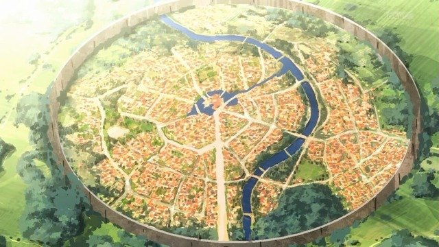

<div align="center">



# TenseiMC
[](LICENSE)

[](https://discord.gg/Zq9GF7qmDW)
</div>


TenseiMC is a drop-in replacement for [Folia](https://github.com/PaperMC/Folia) which is a [Paper](https://github.com/PaperMC/Paper) Fork. It is designed to allow server creators to modify gameplay through configurations with the power of Folia.

TenseiMC is not stable at all and bugs are to be expected. Also, like [Folia](https://github.com/PaperMC/Folia), most plugins on the Spigot markets may not work!

## Contact

Discord : DocktaEnkoda#4311

## Downloads

[Github Actions](https://github.com/DoctaEnkoda/TenseiMC/actions)

## API

```maven
<dependency>
    <groupId>fr.euphilia.tenseimc</groupId>
    <artifactId>TenseiMC-api</artifactId>
    <version>1.20.1-R0.1-SNAPSHOT</version>
</dependency>
```